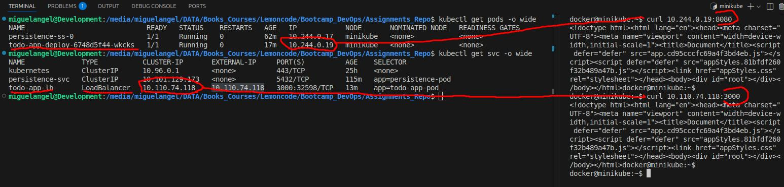

# Exercise 1. Monolith in memory.

Deploy the necessary resources to create an infrastructure like the following picture:

&emsp;

For that, the following resources have been deployed in the cluster:

* A __LoadBalancer__ service, by applying the file [monolith_memory_service.yaml](./00-monolith-in-mem/monolith_memory_service.yaml). This service is targeting the pods that have the label _todo-app-pod_, and accept petitions to its 3000 port and redirecting to the 8080 port of the target pods.

* A __Deployment__ using the monolith image _lemoncodersbc/lc-todo-monolith:v5-2024_, by applying the file [monolith_memory_deployment.yaml](./00-monolith-in-mem/monolith_memory_deployment.yaml). This deployment will create 2 replicas, the pods will have the label _todo-app-pod_ and will accept petitions to its 8080 port.

 
When everything is up and running, we could access to the app from the cluster using both the pod's ip and the loadbalance service:  

&emsp;

 

To access to the app from our browser, we have to run the _minikube tunnel_ command to reach the loadbalancer service from outside the cluster:  

&emsp;

 
After doing that, we will be able to access the app from the browser:  

&emsp;

  

# Exercise 2. Monolith and DB.

Deploy the necessary resources to create an infrastructure like the following picture:

&emsp;

For that, the following resources have been deployed in the cluster:

* A __LoadBalancer__ service, by applying the file [monolith_service_loadbalancer.yaml](./01-monolith-and-db/monolith_service_loadbalancer.yaml). This service is targeting the pods that have the label _todo-app-pod_, and accept petitions to its 3000 port and redirecting to the 8080 port of the target pods. This service will allow us to access the application from outside the cluster.

* A __Deployment__ using the monolith image _lemoncodersbc/lc-todo-monolith-db:v5-2024_, by applying the file [monolith_deployment.yaml](./01-monolith-and-db/monolith_deployment.yaml). The pods will be deployed with the label _todo-app-pod_ and will accept petitions to its 8080 port, as has been defined in the _todo-app-cm_ configmap.

* A __ConfigMap__ called _todo-app-cm_ to define the environtment variables that will use the application pods, by applying the file [monolith_todo_app_cm.yaml](./01-monolith-and-db/monolith_todo_app_cm.yaml). Here we can find the needed data the application needs to connect to the db server. The db host name will be a service that we will create when defining the statefulset.

* A __ClusterIp__ service called _persistence-svc_, by applying the file [monolith_service_clusterip.yaml](./01-monolith-and-db/monolith_service_clusterip.yaml). This service is targeting the pods that have the label _persistence-pod_, and accept petitions to its 5432 port and redirecting to the 5432 port of the target pods. This service will allow the application to access DB server from the cluster and will be the headless service for the statefulset.

* A __StorageClass__, __PersistentVolume__ and __PersistentVolumeClaim__ by applying the file [monolith_persistence.yaml](./01-monolith-and-db/monolith_persistence.yaml). The pv and pvc objects have been created only because the assesstment asked to do so, although actually those two objects __will not be used__ by our infrastructure. That pv will be used by pods that use the pvc in their spec. The StorageClass is called _persistence-sc_ and will be used in the Persistent Volume Template that will be specified in the StatefulSet.

* A __StatefulSet__ using the DB server image _lemoncodersbc/lc-todo-monolith-psql:v5-2024_, by applying the file [monolith_statefulset.yaml](./01-monolith-and-db/monolith_statefulset.yaml). The pods will be deployed with the label _persistence-pod_ and will accept petitions to its 5432 port. The parameters needed to run the server are supplied by the _db-cm_ configmap. Also will use the defined _persistence-sc_ storageclass in the volume claim template that will use to claim a volumen to persist the data.
__
* A __ConfigMap__ called _db-cm_ to define the environtment variables that will use the application pods, by applying the file [monolith_db_cm.yaml](./01-monolith-and-db/monolith_db_cm.yaml). Here we can find the authentication data to run the DB server.

 
After applying all the files, we can check the resources created:  

&emsp; 

&emsp; 

&emsp; 

 
We can check that we can reach the application from the cluster using both the pod's ip and the loadbalancer service:  

&emsp;

 

To access from outside the cluster we need to run _minikube tunnel_ to expose the loadbalancer service:  

&emsp;

 
Once the tunnel is open we can reach the application from the browser. Likewise, accessing the db server pod that the statefulset has created, we can check that the data displayed on the browser is accurate:  

&emsp;

  

# Exercise 3. Distributed

Deploy the necessary resources to create an infrastructure like the following picture:

&emsp;

For that, the following resources have been deployed in the cluster:

* An __Ingress__ resource, by applying the file [distributed_ingress.yaml](./02-distributed/distributed_ingress.yaml). This resource will route the petitions to the services _todo-front-service_ or _todo-api-service_ depending on the path that is used when calling the host _127-0-0-1.nip.io_.

* A __ClusterIp__ service, by applying the file [distributed_front_service.yaml](./02-distributed/distributed_front_service.yaml). This service is targeting the pods that have the label _todo-front-pod_, and accept petitions to its 80 port and redirecting to the 80 port of the target pods. This service will be used by the ingress resource when the url path is __/__.

* A __Deployment__ using the monolith image _lemoncodersbc/lc-todo-front:v5-2024_, by applying the file [distributed_front_deployment.yaml](./02-distributed/distributed_front_deployment.yaml). The pods will be deployed with the label _todo-front-pod_ and will accept petitions to its 80 port, as has been defined in the _todo-app-cm_ configmap.

* A __ClusterIp__ service, by applying the file [distributed_api_service.yaml](./02-distributed/distributed_api_service.yaml). This service is targeting the pods that have the label _todo-api-pod_, and accept petitions to its 80 port and redirecting to the 3001 port of the target pods. This service will be used by the ingress resource when the path is __/api__.

* A __ConfigMap__ called _todo-api-cm_ to define the environtment variables that will use the api pods, by applying the file [distributed_api_cm.yaml](./02-distributed/distributed_api_cm.yaml).

* A __Deployment__ using the monolith image _lemoncodersbc/lc-todo-api:v5-2024_, by applying the file [distributed_api_deployment.yaml](./02-distributed/distributed_api_deployment.yaml). The pods will be deployed with the label _todo-front-pod_ and will accept petitions to its 3001 port, as has been defined in the _todo-api-cm_ configmap.

 

When everything is up and running, we could access the api and the frontend pods from the cluster and from the browser. To expose the ingress resource we need to run the _minikube tunnel_ command:  

&emsp; 

&emsp; 