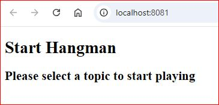

## Jenkins

### 1. Java project CI/CD using the Jenkins server as agent

* Use this [Dockerfile](./gradle.Dockerfile) to create the image __jenkins-bootcamp-gradle__ with gradle installed by running the following command:

  `docker build -t jenkins-bootcamp-gradle -f gradle.Dockerfile .`

* Run the container __jenkins-gradle__ mapping ports and creating a volume by running the following command:

  `docker run -d -p 8080:8080 -p 50000:50000 --volume jenkins-gradle-data:/var/jenkins_home --name jenkins-gradle jenkins-bootcamp-gradle`

* Go to [Jenkins server](http://localhost:8080) and configure it for the very first time, installing the suggested plugins. Also, create a global credentials with the username and personal access token you want Jenkins to use to clone the repo.
* Use this [Jenkinsfle](./Jenkinsfile.exercise1) to execute the `gradlew compileJava` and the `gradlew test` processes within the pipeline.
* Back to [Jenkins server](http://localhost:8080) and create a new pipeline item with the following settings:
  * Definition -> _Pipeline script from SCM_
  * SCM -> _Git_
  * Repository URL -> _https://github.com/MiguelAngelRL/Bootcamp_DevOps.git_
  * Credentials -> _the one you created previously_
  * Branch Specifier -> _*/main_
  * Script Path -> _Module04_CI_CD/jenkins/Jenkinsfile.exercise1_
* Once configured the pipeline, run it by clicking on __Build Now__ from the item dashboard.
* Inspect the [build console log](./Exercise1_Build_Console_Output%20.txt) to check that everything has been executed as expected.

### 2. Java project CI/CD using docker in docker as agent

* Use this [Dockerfile](./dockercli.Dockerfile) to create the image __jenkins-bootcamp-gradle__ with docker cli installed by running the following command:

  `docker build -t jenkins-bootcamp-dockercli -f dockercli.Dockerfile .`

* Use this [bash script file](./start_jenkins.sh) to create all the infrastructure we need (indicating the image name, the network name and the volumes) with the following command:

  `./start_jenkins.sh jenkins-bootcamp-dockercli jenkins-bootcamp jenkins-docker-certs jenkins-dockercli-data`

* Go to [Jenkins server](http://localhost:8080) and configure it for the very first time, installing the suggested plugins. Also:
  * Create a global credentials with the username and personal access token you want Jenkins to use to clone the repo.
  * Install the __Docker__ and __Docker Pipeline__ plugins. Restart the container after installation.
* Use this [Jenkinsfle](./Jenkinsfile.exercise2) to execute the `gradlew compileJava` and the `gradlew test` processes within the pipeline, using the `gradle:6.6.1-jre14-openj9` docker image for the docker in docker agent.
* Back to [Jenkins server](http://localhost:8080) and create a new pipeline item with the following settings:
  * Definition -> _Pipeline script from SCM_
  * SCM -> _Git_
  * Repository URL -> _https://github.com/MiguelAngelRL/Bootcamp_DevOps.git_
  * Credentials -> _the one you created previously_
  * Branch Specifier -> _*/main_
  * Script Path -> _Module04_CI_CD/jenkins/Jenkinsfile.exercise2_
* Once configured the pipeline, run it by clicking on __Build Now__ from the item dashboard.
* Inspect the [build console log](./Exercise2_Build_Console_Output%20.txt) to check that everything has been executed as expected.


## GitHub Actions

### 1. Triggered CI workflow for the hangman-front project to run both the Build and Unit Tests

* This branch [github_actions_1](https://github.com/MiguelAngelRL/Bootcamp_DevOps/tree/github_actions_1) is where the PR has been open.
* This is the [ci.yml](../.github/workflows/ci.yml) used to run the workflow when a change is done into the folder "hangman-front" and a PR is open.
* The executions of the actions can be found here [https://github.com/MiguelAngelRL/Bootcamp_DevOps/actions/workflows/ci.yml]. The first execution failed because there was an error in the unit tests. Once fixed the test, the second time the workflow ended correctly.

### 2. Manual CD workflow for the hangman-front project to both create a Docker image and publish it in the github container registry

* This is the [cd.yml](../.github/workflows/cd.yml) used to run the workflow when a change is done into the folder "hangman-front" and a PR is open.
* The execution of the actions can be found here [https://github.com/MiguelAngelRL/Bootcamp_DevOps/actions/workflows/cd.yml]. The first one failed because ghcr.io was missing in the tag name. The second one failed because the github user should be in lowercase. The third one went well after fixing the previous errors.
* Once finished, to check that the image was correctly generated and uploaded, a container was created in our local machine by running the following command: `docker run -d -p 8081:8080 ghcr.io/miguelangelrl/hangman-front-actions-2024:latest`
* Here is the terminal log that shows how the image is pulled from ghcr.io:
  ```
  latest: Pulling from miguelangelrl/hangman-front-actions-2024
  cbdbe7a5bc2a: Pull complete 
  10c113fb0c77: Pull complete 
  9ba64393807b: Pull complete 
  262f9908119d: Pull complete 
  c4a057508f96: Pull complete 
  13bf34ad7973: Pull complete 
  4f4fb700ef54: Pull complete 
  79a59300ef6e: Pull complete 
  08bb610f128d: Pull complete 
  6d0144882f9d: Pull complete 
  Digest: sha256:f033d768f46f35646e3a0f71376a7b1dbe31d19a5aedf3286cfd35b8375b4e1e
  Status: Downloaded newer image for ghcr.io/miguelangelrl/hangman-front-actions-2024:latest
  bc5cddad930a8a1d0075ae7af1931bebdcb75243b5a11950c13678154262e46d
  ```
* This is what we got on the browser:

  

### Workflow to perform e2e tests
* This is the [e2e.yml](../.github/workflows/e2e.yml) used to run the manual workflow.
* The execution of the actions can be found here [https://github.com/MiguelAngelRL/Bootcamp_DevOps/actions/workflows/e2e.yml]. Some executions failed due to different problems, like not setting the correct working dir or not having the api and app servers up and running. Once everything was fixed, the workflow ran successfully.

